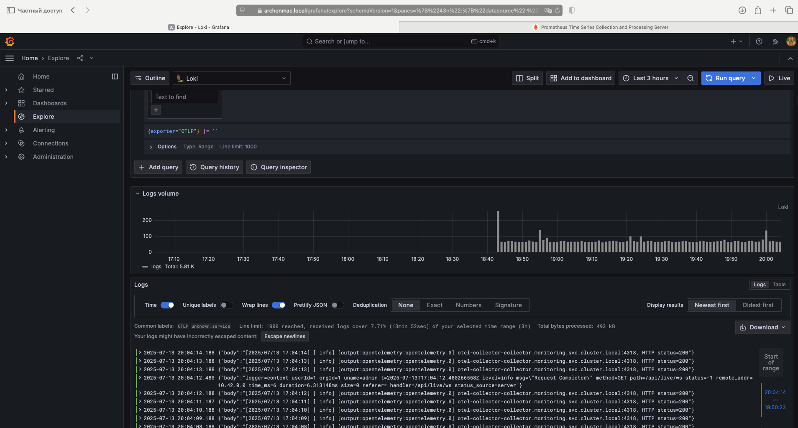
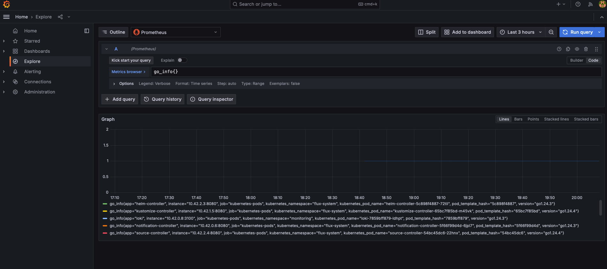
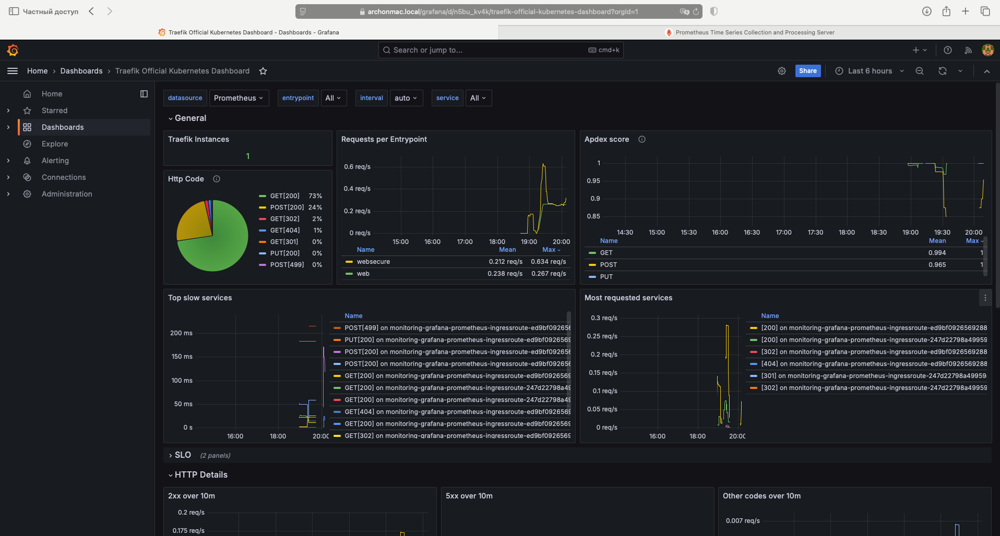
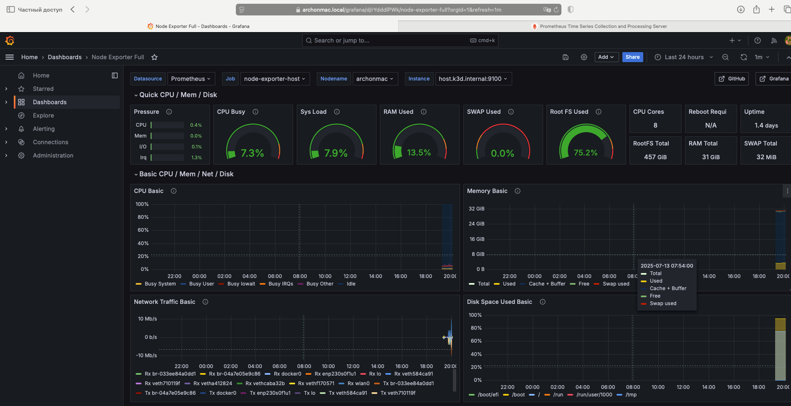
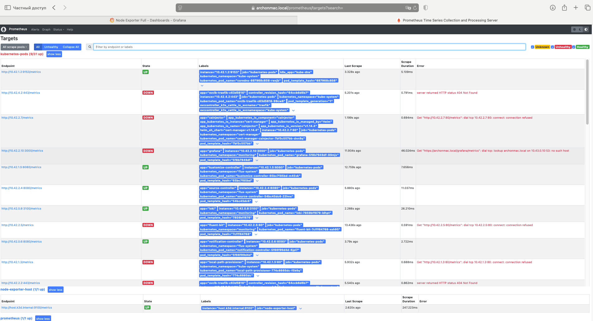
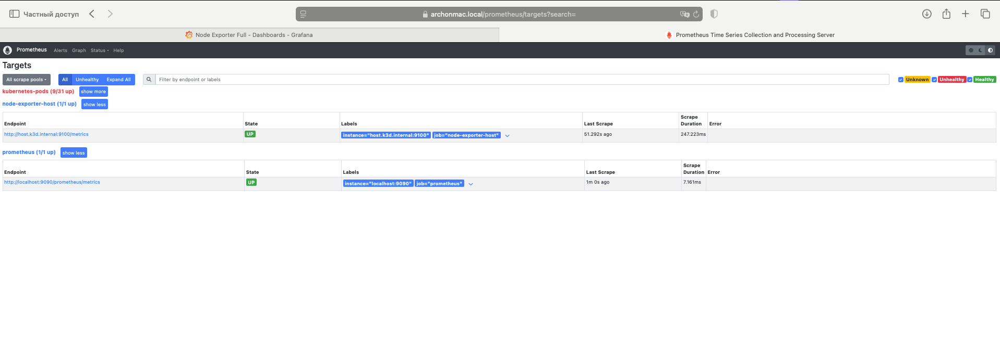

# Розгортання стека моніторингового  в кластері kubernetes за допомогою [flux cd](https://fluxcd.io) 

Цей репозиторій містить інфраструктурний код для розгортання моніторінгового стека у кластері Kubernetes
> як шаблон було використано еталонний репозиторій [kbot](https://github.com/den-vasyliev/kbot/tree/opentelemetry/), 
> зокрема конфігурація [docker-compose.yaml](https://github.com/den-vasyliev/kbot/blob/opentelemetry/otel/docker-compose.yaml).

## 📦 Компоненти

Моніторинговий стек включає наступні інструменти:

- **[OpenTelemetry Collector](https://opentelemetry.io/docs/collector/)** — прийом, обробка та передача логів, метрик і трейсів.
- **[Prometheus](https://prometheus.io/)** — збір та зберігання метрик.
- **[Fluent Bit](https://fluentbit.io/)** — збирання та переадресація логів.
- **[Grafana Loki](https://grafana.com/oss/loki/)** — система агрегації логів, сумісна з Prometheus-лейблами.
- **[Grafana](https://grafana.com/)** — візуалізація метрик, логів та трейсів.


## ⚙️ Кроки для розгортання

### 1. Ініціалізація кластеру

Переконайтесь, що встановлено [k3d](https://k3d.io/) та [Terraform](https://www.terraform.io/).
Ініціалізуємо flux за схемою monorepo
```bash
export KUBER_HOST_IP=$(hostname -i | awk '{print $1}')
k3d cluster create k3d-otel --api-port "$KUBER_HOST_IP:6443" --k3s-arg "--tls-san=$KUBER_HOST_IP@server:0" --k3s-arg "--tls-san=$(hostname -s).local@server:0" -p "443:443@loadbalancer" -a 3
k3d kubeconfig get k3d-otel > ~/k3d-otel.yaml
export KUBECONFIG=~/k3d-otel.yaml

cd tf-bootstrap/github
terraform init
terraform apply 
cd ../../
```

Ці команди створять кластер k3d та базову інфраструктуру.

### 2. Додаємо підтримку sops для можливості розшифрувати зашифрований токен для kbot

Створення секрету для доступу до AWS KMS за допомогою IAM користувача

Перед створенням секрету переконайтеся, що у вас є необхідні облікові дані **AWS IAM** користувача.

2.1  **Експорт змінних середовища AWS:**
    Замініть плейсхолдери `<ваш_регіон>`, `<ваш_ключ_доступу>` та `<ваш_секретний_ключ_доступу>` на ваші фактичні значення.

    ```bash
    export AWS_DEFAULT_REGION="<ваш_регіон>" # Наприклад, eu-west-1
    export AWS_ACCESS_KEY_ID="<ваш_ключ_доступу>"
    export AWS_SECRET_ACCESS_KEY="<ваш_секретний_ключ_доступу>"
    ```

Перевірка облікових даних AWS:
    Ця команда підтвердить, що ваші облікові дані AWS налаштовані правильно.

    ```bash
    aws sts get-caller-identity
    ```

2.2 **Створення Kubernetes секрету:**
    Цей скрипт створить Kubernetes секрет з вашими AWS обліковими даними, який буде використовуватися для доступу до KMS.

    ```bash
    bash iac/scripts/kube2iam-create-secret.sh
    ```
2.3 **Налаштування розшифрування секретів у кластері за допомогою SOPS та AWS KMS**

Щоб Flux CD міг розшифровувати секрети, зашифровані SOPS з використанням AWS KMS, необхідно внести зміни до конфігурації Flux CD.

2.3.1  **Додавання патчів до `clusters/archonmac/flux-system/kustomization.yaml`:**
    Відкрийте файл `clusters/archonmac/flux-system/kustomization.yaml` та додайте наступні рядки:

    ```yaml
    - ../../../iac/environments/dev1 # Переконайтеся, що цей шлях коректний для вашого середовища
    patchesStrategicMerge:
      - patch-kustomization-decryption.yaml
      - patch-kustomize-env.yaml
    ```

2.3.2  **Створення файлу `patch-kustomization-decryption.yaml`:**
    Створіть новий файл `patch-kustomization-decryption.yaml` у директорії `clusters/archonmac/flux-system` з наступним вмістом:

    ```yaml
    apiVersion: kustomize.toolkit.fluxcd.io/v1
    kind: Kustomization
    metadata:
      name: flux-system
      namespace: flux-system
    spec:
      decryption:
        provider: sops
        secretRef:
          name: kube2iam-aws-credentials
    ```

    Цей патч налаштовує `Kustomization` Flux для використання **SOPS** як провайдера дешифрування.

2.3.3  **Створення файлу `patch-kustomize-env.yaml`:**
    Створіть новий файл `patch-kustomize-env.yaml` у тій же директорії `clusters/archonmac/flux-system` з наступним вмістом:

    ```yaml
    ---
    apiVersion: apps/v1
    kind: Deployment
    metadata:
      name: kustomize-controller
      namespace: flux-system
    spec:
      template:
        spec:
          containers:
            - name: manager
              env:
                - name: AWS_ACCESS_KEY_ID
                  valueFrom:
                    secretKeyRef:
                      name: kube2iam-aws-credentials
                      key: AWS_ACCESS_KEY_ID
                - name: AWS_SECRET_ACCESS_KEY
                  valueFrom:
                    secretKeyRef:
                      name: kube2iam-aws-credentials
                      key: AWS_SECRET_ACCESS_KEY
                - name: AWS_REGION
                  valueFrom:
                    secretKeyRef:
                      name: kube2iam-aws-credentials
                      key: AWS_DEFAULT_REGION
    ```

    Цей патч інжектує AWS облікові дані (доступ до KMS) у змінних середовища `kustomize-controller` контейнера, дозволяючи йому виконувати дешифрування.

2.3.4  **Коміт змін та позачергова реконсиляція:**
    Коміемо внесені зміни  `master`  та запускаємо позачергову реконсиляцію Flux:

    ```bash
    flux reconcile kustomization flux-system --with-source
    ```

-----

### 3. Встановлення компонентів моніторинга у кластер
Додаємо компоненти fluent-bit,grafana,prometheus,otel-collector та otel-operator в [iac/environments/dev1/kustomization.yaml](iac/environments/dev1/kustomization.yaml) 
Далі коміт і реконсиляція
```yaml
resources:
  - ../../apps/cert-manager
  - ../../apps/otel-operator
  - ../../apps/monitoring
  - ../../apps/kbot-otel
```
перевіряєм  поди моніторинга
```shell
kubectl get pod -n monitoring
```
як результат має бути запущені поди
```text
NAME                                      READY   STATUS    RESTARTS   AGE
fluent-bit-7cfff64768-rfl28               1/1     Running   0          4m18s
grafana-6499cd779c-qnjpb                  1/1     Running   0          4m18s
loki-7859bff879-kcf8l                     1/1     Running   0          4m18s
otel-collector-collector-b659bb46-dsgt5   1/1     Running   0          3m15s
prometheus-5c7cdcc9c6-trtgb               1/1     Running   0          4m18s
```
додатково теба виконати path для kbot для встановлення змінної METRICS_HOST 
та створити зашифрований токен для kbot у [secret.sops.yaml](iac/apps/kbot-otel/secret.sops.yaml) за допомогою sops
```shell
    kubectl apply -f iac/apps/kbot-otel/patch-env.yaml
```

### 4. Налаштуємо traefik для публікації web інтерфейсів grafana та prometheus
Додаємо зміни у [iac/environments/dev1/kustomization.yaml](iac/environments/dev1/kustomization.yaml)
Далі коміт і реконсиляція
```yaml
resources:
 ...
  - ../../apps/traefik-tuning
```

### Демо дашборди Grafana. 
Grafana буде доступна за URL  [https://archonmac/grafana](https://archonmac/grafana)

Prometheus буде доступний за URL [https://archonmac/prometheus](https://archonmac/prometheus)









